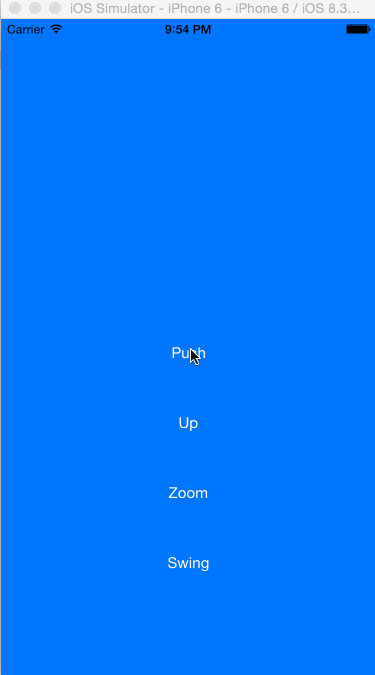
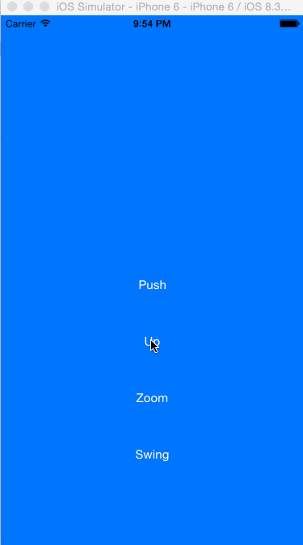
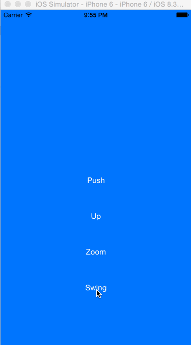

# WYInteractiveTransitions

[](https://travis-ci.org/Yu Wang/WYInteractiveTransitions)
[](http://cocoapods.org/pods/WYInteractiveTransitions)
[](http://cocoapods.org/pods/WYInteractiveTransitions)
[](http://cocoapods.org/pods/WYInteractiveTransitions)


Customized transitions between view controllers for iOS. One Line of code with fully interactive animations. Written purely in Swift.

**Four animations is embedded right now:**
* Push


* SlideUp


* Swing


* Zoom


* And your customized animations


## Installation

WYInteractiveTransitions is available through [CocoaPods](http://cocoapods.org). To install
it, simply add the following line to your Podfile:

```ruby
pod "WYInteractiveTransitions"
```


Or download the git repository
```
$ git clone https://github.com/yuwang17/WYInteractiveTransitions.git
```

2) Drag ``WYInteractiveTransitions.swift`` file into your own project

Then import the module in your file
```
import WYInteractiveTransitions
```

If you're Objective-C user, please include the header file
```
#import "WYInteractiveTransitions-Swift.h"
```

## Usage
1) Create instance
```
$ let transitionMgr = WYInteractiveTransitions()
```
2) Configure WYInteractiveTransitions in proper position
```
$ transitionMgr.configureTransition(duration: 0.5, toViewController: toView!, 
                                 handGestureEnable: true, transitionType: WYTransitoinType.Push)
```
3) Present view controller or dismiss would invoke the transitions
* ``performSegueWithIdentifier``
* ``presentViewController``
* ``dismissViewController``
* ``unwindViewController``
* etc...

## Example Codes
```
$ let transitionMgr = WYInteractiveTransitions()
$ override func prepareForSegue(segue: UIStoryboardSegue, sender: AnyObject?) {
$   if segue.identifier == "showSegue" {
$     let toView = segue.destinationViewController as? UIViewController
$       transitionMgr.configureTransition(duration: 0.5, toViewController: toView!, 
$                                       handGestureEnable: true, transitionType: WYTransitoinType.Push)
$   }
$ }
```

## Demo
1) Download the repository
```
$ git clone https://github.com/yuwang17/WYInteractiveTransitions.git
$ cd WYInteractiveTransitions/Example
```

2) Open the workspace
```
$ open WYInteractiveTransitions.xcodeproj
```

3) Compile and run the app in simulator
* Under Xcode, press ``Ctrl + R``

## Requirements
* Xcode 6
* iOS 7

## Flaws
With gesutre enabled, there's no way animated to dismissed view controller when user screen edge pan gesture is cancelled.
```
$ else if gesture.state == .Cancelled || gesture.state == .Failed || gesture.state == .Ended {
$   finishInteractiveTransition()
$ }
```
The perfect solution is to add ``cancelInteractiveTransition()`` in above gesture selector, but a new problem arised: whenever ``cancelInteractiveTransition()`` is called, the dismissed view controller is no longer exist; therefore a black screen is displayed.

## LICENSE
WYInteractiveTransitions is available under the [MIT License](LICENSE), see LICENSE for more infomation.
